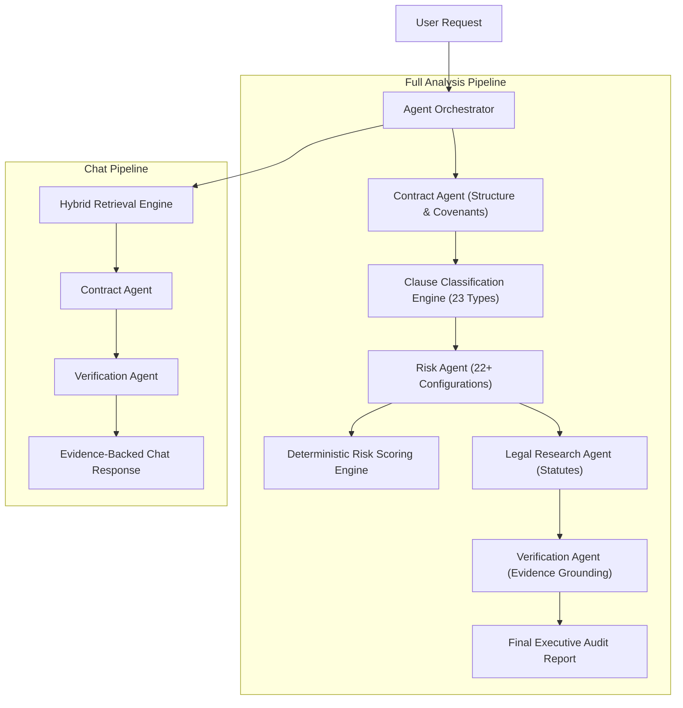

# LexGuard: Multi-Agent Architecture & Deterministic Scoring Specification

## 1. Agent Architecture Philosophy
LexGuard rejects monolithic prompts in favor of specialized, task-scoped agents. Each agent possesses bounded authority, verifiable inputs, and strongly typed Zod-compatible outputs.

---

## 2. Agent Catalog & Responsibilities

### 2.1 Contract Agent (`contractAgent.ts`)
- **Role**: Document Intelligence & Covenant Synthesis.
- **Responsibilities**:
  - Parses preambles to identify counterparty names, legal form (LLC, Inc.), and execution dates.
  - Summarizes core operational covenants (payment schedules, notice obligations, intellectual property allocation).
  - Produces executive summaries contextualizing the transaction.

### 2.2 Risk Agent (`riskAgent.ts`)
- **Role**: Contractual Exposure Detection.
- **Responsibilities**:
  - Evaluates extracted clauses against 22+ known risky legal configurations:
    - Unlimited liability & missing aggregate cap
    - Unilateral termination for convenience
    - Abrupt notice windows (< 15 days)
    - Evergreen automatic renewal traps
    - Excessive late penalties & liquidated damages
    - Loss of pre-existing background IP
    - Overly broad restrictive covenants & non-competes
    - Unfavorable foreign jurisdiction & governing law
  - Generates clear "Why It Matters" business impact explanations and actionable redline recommendations.

### 2.3 Research Agent (`researchAgent.ts`)
- **Role**: Statutory Grounding & External Precedents.
- **Responsibilities**:
  - Queries the legal knowledge repository for relevant statutory provisions matching detected risks (e.g. UCC § 2-719 for consequential damages, GDPR Art. 28 for data processing).
  - Formats legal citations to supplement internal contract evidence.

### 2.4 Comparison Agent (`comparisonAgent.ts`)
- **Role**: Comparative Contract Analysis & Favorability Assessment.
- **Responsibilities**:
  - Analyzes two executed agreements across 9 key dimensions (Liability, Termination, Renewal, IP, Confidentiality, Payment, Dispute Resolution, Governing Law, Data Protection).
  - Assesses which contract version is safer (`A safer`, `B safer`, `Equal / Mutual`) with supporting rationale and clause excerpts.

### 2.5 Verification Agent (`verificationAgent.ts`)
- **Role**: Fact-Checking & Anti-Hallucination Guardrail.
- **Responsibilities**:
  - Cross-references generated assertions against raw contract clauses.
  - Confirms cited section numbers and pages exist.
  - Flags unsupported claims and computes an objective grounding confidence score ($0.0 - 1.0$).

---

## 3. Deterministic Risk Scoring Framework
The LLM is **strictly prohibited** from generating arbitrary risk scores. All risk metrics are computed deterministically.

### 3.1 Individual Risk Score Formula
Each risk finding is assigned three bounded parameters:
- **Severity** ($S \in [1, 5]$): Legal severity of the clause.
- **Probability** ($P \in [1, 5]$): Likelihood of dispute or breach enforcement.
- **Impact** ($I \in [1, 5]$): Commercial and financial magnitude if triggered.

$$\text{Raw Score} = S \times P \times I \quad (\text{Range: } 1 \text{ to } 125)$$
$$\text{Normalized Risk Score} = \min\left(100, \text{round}\left(\frac{\text{Raw Score}}{125} \times 100\right)\right)$$

### 3.2 Risk Levels
| Normalized Score | Risk Level | Badge Color | Immediate Action Required |
| :---: | :---: | :---: | :---: |
| **76 – 100** | **Critical** | Rose / Crimson | Mandatory executive & legal counsel signoff; strike or cap |
| **51 – 75** | **High** | Orange / Amber | Active redline negotiation recommended |
| **26 – 50** | **Moderate** | Yellow / Gold | Commercial business review and operational monitoring |
| **0 – 25** | **Low** | Emerald / Mint | Balanced commercial covenant |

### 3.3 Weighted Overall Contract Score
Individual risks are aggregated into 7 core categories with configurable weights:
- Financial ($w = 1.3$)
- Intellectual Property ($w = 1.3$)
- Legal ($w = 1.2$)
- Compliance ($w = 1.2$)
- Privacy ($w = 1.1$)
- Operational ($w = 1.0$)
- Commercial ($w = 1.0$)

$$\text{Overall Contract Score} = \frac{\sum_{c} \text{CategoryScore}_c \times w_c}{\sum_{c} w_c}$$

*Guaranteed Critical Floor*: If any individual finding is categorized as **Critical** ($\ge 76$), the contract risk score floor cannot fall below 68.