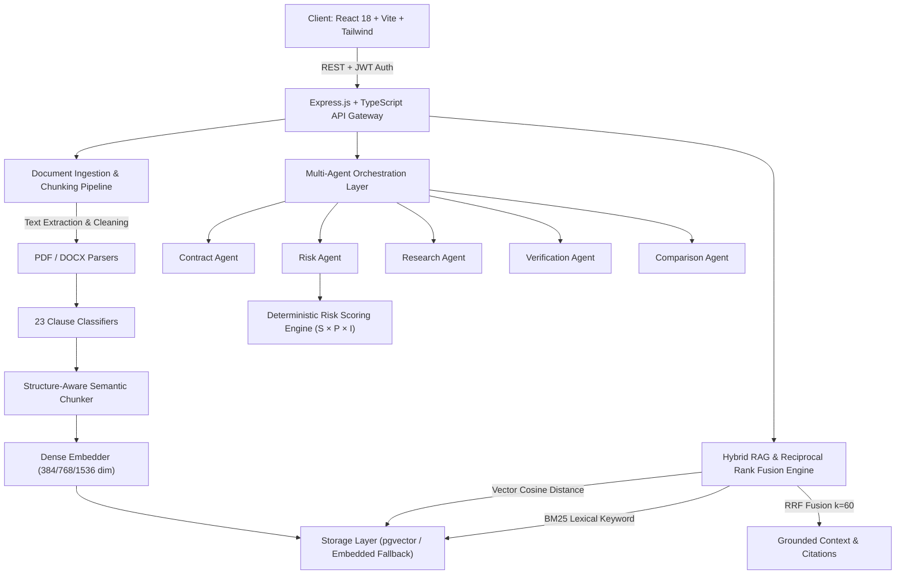

# LexGuard: System Architecture Specification

## 1. Overview
LexGuard is an enterprise LegalTech SaaS platform engineered for automated contract risk detection, clause classification, and grounded RAG legal intelligence. It transitions contract review from manual human redlining into an auditable multi-agent workflow backed by deterministic risk scoring and evidence retrieval.

## 2. High-Level Architectural Flow

## 3. Subsystem Breakdown

### 3.1 Ingestion & Document Processing
1. **Multipart Upload**: Multer processes incoming PDF and DOCX binaries with strict MIME validation and 25MB buffer thresholds.
2. **Text Normalization**: Strips typographic noise while maintaining carriage boundaries and page breaks.
3. **Structure Detection**: Heuristic regex scanning identifies Articles, Sections, Subsections, and numbered covenants (`Section \d+(\.\d+)*`).
4. **Semantic Chunking**: Contracts are never chunked as monolithic documents. Each chunk retains:
   - `contractId`: Foreign key to document.
   - `pageNumber`: Exact page in original document.
   - `sectionNumber`: e.g. "Section 5.2" or "Article III".
   - `sectionTitle`: Heading descriptor.
   - `clauseType`: One of 23 legal clause categories.
   - `text`: Raw clause snippet.

### 3.2 Hybrid RAG Engine (Reciprocal Rank Fusion)
Standard dense vector search frequently fails on legal contracts due to semantic overlap between benign and risky covenants. LexGuard implements a dual-path hybrid retrieval engine:
1. **Dense Vector Search**: Computes cosine similarity between query embedding and chunk vectors:
   $$\text{Cosine Similarity}(u, v) = \frac{u \cdot v}{\|u\|_2 \|v\|_2}$$
2. **Lexical Keyword Search**: Queries inverted term frequencies across clauses.
3. **Reciprocal Rank Fusion (RRF)**: Merges the top-$K$ candidates:
   $$\text{RRF\_Score}(d) = \sum_{m \in \{\text{vector}, \text{keyword}\}} \frac{1}{k + \text{rank}_m(d)}$$
   where $k = 60$.

### 3.3 Multi-Agent Orchestration Layer
- **Orchestrator**: Evaluates whether the request is a full document analysis, comparative review, or a targeted conversational query, dispatching only the required agents.
- **Contract Agent**: Synthesizes contractual covenants, party recitals, notice requirements, and obligation summaries.
- **Risk Agent**: Evaluates extracted clauses against 22+ risk configurations.
- **Research Agent**: Traverses the authoritative legal knowledge base to retrieve applicable statutory precedents (e.g. UCC § 2-719, GDPR Art. 28, DGCL § 145).
- **Comparison Agent**: Compares two contracts across 9 core dimensions and assigns favorability.
- **Verification Agent**: Validates that AI-generated statements possess direct textual grounding in retrieved chunks, flagging hallucinations.

### 3.4 Dual Database Architecture
LexGuard is built to operate flexibly in any environment:
1. **Production Mode**: Connects to PostgreSQL with the `pgvector` extension for pg-native vector indexing (`vector(384)` / `vector(1536)`).
2. **Embedded Fallback Mode**: Activates if PostgreSQL is unavailable, executing in-memory mathematical cosine similarity and JSON persistence with zero startup friction.