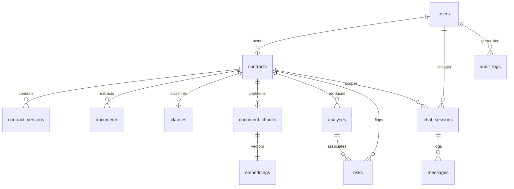

# LexGuard: Database & Storage Specification

## 1. Overview
LexGuard uses an enterprise relational and vector schema designed for PostgreSQL + `pgvector`, with an automatic zero-friction fallback to an embedded in-memory/JSON store with vector cosine similarity for offline or single-machine academic viva demonstrations.

---

## 2. Entity-Relationship Diagram (ERD)

---

## 3. Core Table Definitions

### 3.1 `contracts`
Main metadata record for an uploaded legal agreement.
- `id`: UUID (Primary Key)
- `user_id`: UUID (Foreign Key `users.id` ON DELETE CASCADE)
- `title`: VARCHAR(255)
- `contract_type`: VARCHAR(100) (e.g. Master Services Agreement)
- `file_name`: VARCHAR(255)
- `file_size`: BIGINT
- `file_type`: VARCHAR(20) (`pdf` or `docx`)
- `file_path`: TEXT
- `status`: VARCHAR(50) (`UPLOADED`, `PROCESSING`, `ANALYZED`, `FAILED`)
- `overall_score`: NUMERIC(5, 2) (Deterministic 0 - 100)
- `risk_level`: VARCHAR(50) (`Low`, `Moderate`, `High`, `Critical`)
- `processing_progress`: INT (0 to 100)
- `processing_stage`: VARCHAR(100)
- `created_at`: TIMESTAMP WITH TIME ZONE
- `updated_at`: TIMESTAMP WITH TIME ZONE

### 3.2 `clauses`
Extracted and classified clauses from the contract.
- `id`: UUID (Primary Key)
- `contract_id`: UUID (Foreign Key `contracts.id` ON DELETE CASCADE)
- `clause_number`: VARCHAR(50) (e.g. "Section 5.0")
- `clause_type`: VARCHAR(100) (23 categories, e.g. "Liability", "Termination")
- `title`: VARCHAR(255)
- `page_number`: INT
- `text`: TEXT
- `confidence`: NUMERIC(4, 3) (e.g. 0.950)
- `favorable_to`: VARCHAR(50) (`mutual`, `client`, `counterparty`, `unfavorable_to_all`)

### 3.3 `document_chunks`
Semantic partitions used for hybrid vector and lexical retrieval.
- `id`: UUID (Primary Key)
- `contract_id`: UUID (Foreign Key `contracts.id` ON DELETE CASCADE)
- `chunk_index`: INT
- `page_number`: INT
- `section_number`: VARCHAR(50)
- `section_title`: VARCHAR(255)
- `clause_type`: VARCHAR(100)
- `text`: TEXT
- `tsv_content`: TSVECTOR (Postgres Full-Text Search GIN index)

### 3.4 `embeddings`
Vector representations of document chunks.
- `id`: UUID (Primary Key)
- `chunk_id`: UUID (Foreign Key `document_chunks.id` ON DELETE CASCADE)
- `contract_id`: UUID (Foreign Key `contracts.id` ON DELETE CASCADE)
- `embedding`: `vector(384)` (or 768 / 1536 depending on provider)

### 3.5 `risks`
Individual contractual risk findings identified by the Risk Agent.
- `id`: UUID (Primary Key)
- `contract_id`: UUID (Foreign Key `contracts.id` ON DELETE CASCADE)
- `analysis_id`: UUID (Foreign Key `analyses.id` ON DELETE CASCADE)
- `title`: VARCHAR(255) (e.g. "Unlimited Liability & Absence of Cap")
- `category`: VARCHAR(100) (`Financial`, `Legal`, `Operational`, `Commercial`, `Privacy`, `IP`)
- `severity`: INT (1 to 5)
- `probability`: INT (1 to 5)
- `impact`: INT (1 to 5)
- `score`: NUMERIC(5, 2) (0 to 100)
- `level`: VARCHAR(50) (`Low`, `Moderate`, `High`, `Critical`)
- `description`: TEXT
- `why_it_matters`: TEXT
- `recommendation`: TEXT
- `contract_evidence`: JSONB (`{ "page": 1, "section": "Section 5.0", "text": "..." }`)
- `legal_sources`: JSONB (Statutory references)
- `verified`: BOOLEAN

### 3.6 `legal_sources`
Precedent library of public statutes and regulations.
- `id`: UUID (Primary Key)
- `title`: VARCHAR(255)
- `source`: VARCHAR(255)
- `jurisdiction`: VARCHAR(100)
- `section`: VARCHAR(100)
- `url`: TEXT
- `content`: TEXT
- `embedding`: `vector(384)`

### 3.7 `audit_logs`
Security and observability audit trail.
- `id`: UUID (Primary Key)
- `user_id`: UUID
- `action`: VARCHAR(255) (e.g. `CONTRACT_ANALYZED`, `USER_LOGIN`)
- `entity_type`: VARCHAR(100)
- `entity_id`: VARCHAR(255)
- `details`: JSONB
- `ip_address`: VARCHAR(100)
- `created_at`: TIMESTAMP WITH TIME ZONE

---

## 4. Indexing & Optimization Strategy
1. **Relational Foreign Key B-Trees**:
   - `idx_contracts_user_id` on `contracts(user_id)`
   - `idx_clauses_contract_id` on `clauses(contract_id)`
   - `idx_risks_contract_id` on `risks(contract_id)`
   - `idx_chunks_contract_id` on `document_chunks(contract_id)`
2. **Postgres Full-Text Search**:
   - GIN index on `document_chunks(tsv_content)` enables fast BM25-equivalent keyword ranking.
3. **pgvector Indexing**:
   - IVFFlat or HNSW cosine index on `embeddings(embedding vector_cosine_ops)`.