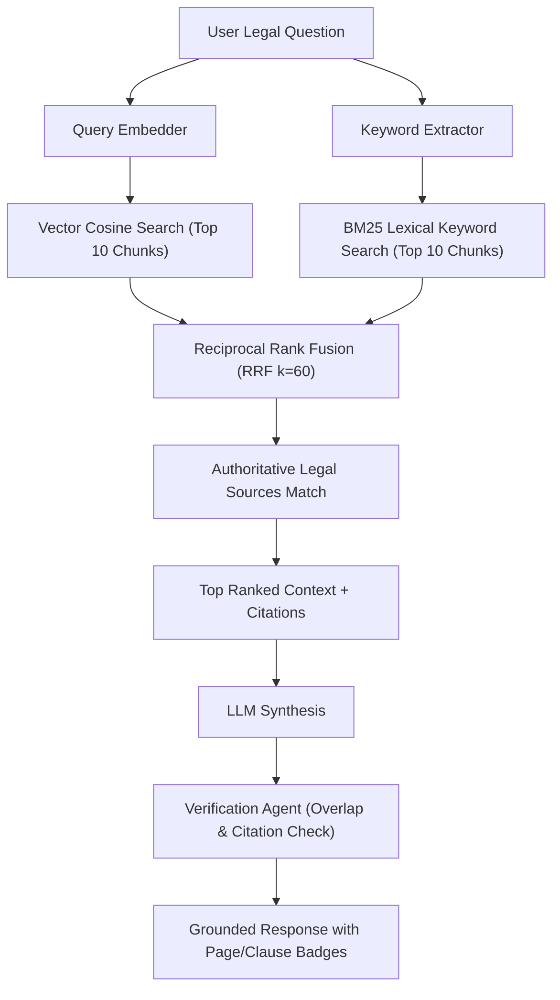

# LexGuard: Retrieval-Augmented Generation (RAG) Architecture

## 1. The Legal RAG Challenge
Legal documents differ fundamentally from standard conversational text:
- Standard chunking (fixed token size e.g. 500 characters) cuts arbitrary sentences in the middle of indemnities or liability caps, distorting legal meaning.
- Semantic vector similarity alone often matches semantically related concepts with opposing legal effects (e.g. "mutual aggregate liability cap" vs "uncapped unilateral liability").

To resolve these challenges, LexGuard introduces a **Structure-Aware, Multi-Source Hybrid RAG Pipeline**.

---

## 2. Structure-Aware Semantic Chunking
Instead of arbitrary sliding windows, LexGuard splits contracts along logical legal boundaries:
1. **Section Boundaries**: Detected via Article/Section regex parsing.
2. **Metadata Enrichment**: Every chunk is stored with:
   - `contractId`: Document identifier.
   - `pageNumber`: Physical or estimated page number.
   - `sectionNumber`: e.g. `Section 5.0` or `Article IV`.
   - `sectionTitle`: e.g. `Limitation of Liability`.
   - `clauseType`: One of 23 legal categories.
   - `text`: Pure clause body.
   - `embedding`: Dense vector embedding.

---

## 3. Hybrid Retrieval & Reciprocal Rank Fusion (RRF)

### 3.1 Cosine Similarity Formulation
For dense semantic matching:
$$\text{sim}_{\text{vector}}(q, c) = \frac{\sum_{i=1}^d q_i c_i}{\sqrt{\sum_{i=1}^d q_i^2} \sqrt{\sum_{i=1}^d c_i^2}}$$

### 3.2 Reciprocal Rank Fusion Formula
To balance keyword precision (exact terms like "Net 30" or "liquidated damages") with dense semantic comprehension, LexGuard computes:
$$\text{RRF\_Score}(d) = \sum_{m \in \{\text{vector}, \text{keyword}\}} \frac{1}{k + \text{rank}_m(d)}$$
where $k = 60$ is the standard smoothing constant preventing rank outliers from dominating.

---

## 4. Multi-Source Knowledge Retrieval
LexGuard retrieves concurrently from two isolated domains:
1. **Document-Internal Chunks**: The specific uploaded contract being analyzed.
2. **Authoritative External Statutes**: Reference laws (e.g. Uniform Commercial Code § 2-719, GDPR Article 28, Delaware General Corporation Law § 145).

The orchestrator explicitly enforces separation in generated prompts, guaranteeing the user knows whether a citation originates from their contract or a public statute.

---

## 5. Claim Verification & Anti-Hallucination Guardrails
Before delivering a response to the user:
1. The **Verification Agent** analyzes the generated text against retrieved chunks.
2. It checks for lexical and key-term overlap with the claimed section numbers and quotes.
3. If no sufficient evidence exists in the indexed contract chunks, the system strictly returns:
   > *"I could not find sufficient evidence in the available documents to answer this confidently."*
4. All verified citations include clickable navigation anchors that highlight the clause directly in the document viewer.